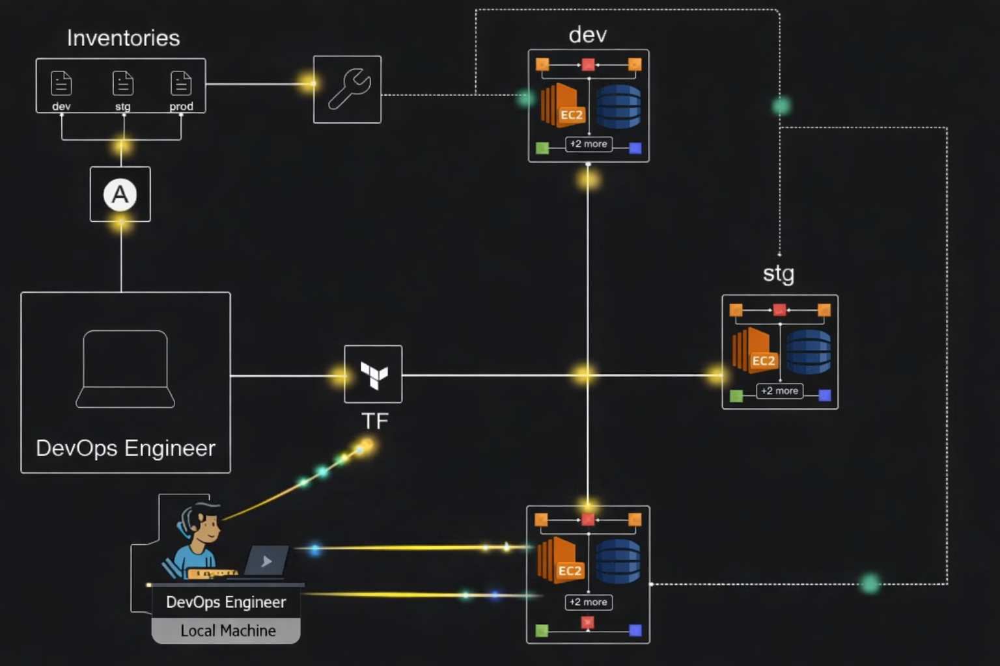

# Multi-Environment AWS Infrastructure with Terraform Modules

## 📌 Project Overview
This project automates the deployment of a scalable AWS infrastructure across three distinct environments: Development (Dev), Staging (Stg), and Production (Prd). By utilizing Terraform Modules, the setup ensures code reusability, consistency, and easy environment management.

## 🏗 Architecture Components
- Compute: EC2 Instances (t3 family) running Ubuntu 24.04 LTS.
- Storage: S3 Buckets for object storage.
- Database: DynamoDB tables for NoSQL data.
- Security: Dynamic Security Groups and SSH Key Pairs.
- Network: Deployment centered in the us-east-1 (N. Virginia) region.

## 📐 Architecture & Infrastructure Flow
The following flow describes how the infrastructure is provisioned and managed:

1. Local Development (The Source)
- Environment: Development is performed on a MacBook Air using VS Code.
- Security: An SSH Key Pair (terra-key-ec2) is generated locally. The public key is injected into the AWS instances during the provisioning phase to allow secure access.

2. Infrastructure as Code (The Logic)
- Terraform Engine: Uses the HashiCorp Terraform CLI to parse the modular configuration.
- State Management: Terraform creates a terraform.tfstate file to track the real-world resources against the local configuration.
- Provider: Connects to the AWS Provider specifically configured for the us-east-1 (North Virginia) region.

3. Modular Deployment (The Execution)
The root configuration calls a reusable infra-app module three times, passing different variables for each environment:

Environment | Instance Type | Storage (gp3) | Purpose
--- | --- | --- | ---
Development | t2.micro | 10 GB | Sandbox for feature testing
Staging | t2.small | 10 GB | Pre-production integration testing
Production | t2.medium | 20 GB | High-availability user-facing environment

## 🏗 Architecture Diagram

<p align="center">
  
</p>

## 📁 Directory Structure
```
.
├── main.tf                # Root module calling environment modules 
├── provider.tf            # AWS Provider configuration 
├── variables.tf           # Global variables 
├── infra-app/             # REUSABLE MODULE  
│   ├── ec2.tf             # EC2 and Key Pair logic
│   ├── s3.tf              # S3 Bucket definition
│   ├── dynamodb.tf        # DynamoDB table configuration
│   ├── variables.tf       # Module-specific variables
│   └── outputs.tf         # Resource outputs
|   └── terra-key-ec2.pub  # Generated SSH Public Key
└── terra-key-ec2.pub      # Generated SSH Public Key
```

## 🚀 Getting Started

### Prerequisites
- Terraform
- AWS CLI configured

### Generate SSH Key
`ssh-keygen -f terra-key-ec2`

### Deployment
```
# Initialize the project and download providers
terraform init

# Preview the infrastructure changes for all 3 environments
terraform plan

# Deploy the infrastructure to AWS
terraform apply -auto-approve
```

## 🛠 Technical Challenges Solved
#### Fixed ARM64 vs x86_64 mismatch
During development, I resolved a critical mismatch where ARM64 AMIs were being applied to x86_64 t2 instances. The project now correctly utilizes x86_64 (Intel) AMIs to maintain         compatibility with Free Tier eligible hardware.
   
#### BIOS compatibility ensured
Since t2.micro instances do not support UEFI boot modes, the module is specifically configured to use Legacy BIOS compatible AMIs (hvm), ensuring successful instance initialization in the us-east-1 region.

#### Modular env-based logic  
Implemented a var.env variable to handle environment-specific logic, such as:
- Storage: Production environments use larger 20GB gp3 volumes, while Dev/Stg use 10GB.
- Naming: All resources follow a strict ${var.env}-infra-app naming convention for easy tracking in the AWS Console.

## 📋 Variables
| Name | Description | Default |
|------|------------|---------|
| region | AWS region | us-east-1 |
| instance_type | EC2 size | t3.micro |
| env | environment | dev/stg/prd |
| instance_count | instances | 1 |

## 🧹 Cleanup
To avoid unnecessary AWS costs, always destroy the infrastructure after testing:

`terraform destroy -auto-approve  `

---
Created by Ritesh Kumar Swain
